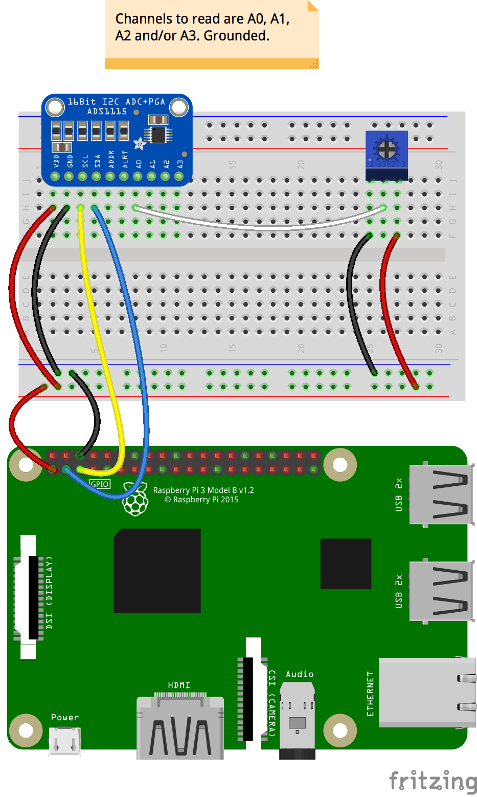

### MCP3008 Sample

> Run the script named `samplemenu.sh`, option `3`.

### ADS1x15 Sample

Same wiring for `ADS1015` and `ADS1115` (and all I<small>2</small>C devices, actually).

> Run the script named `samplemenu.sh`, option `9`.

